# SOLE — Sơ đồ luồng chức năng

> Tài liệu trực quan mô tả **luồng nghiệp vụ thực tế** (đối chiếu code tại `main`, 08/2026).  
> Chi tiết API/model: [`SHOE_ECOMMERCE_SPECIFICATION.md`](./SHOE_ECOMMERCE_SPECIFICATION.md)  
> Return/refund sâu: [`RETURN_REFUND_SPEC.md`](./RETURN_REFUND_SPEC.md) · Runbook: [`RUNBOOK_REFUND.md`](./RUNBOOK_REFUND.md)

---

## Mục lục

1. [Bản đồ module](#1-bản-đồ-module)
2. [Xác thực & phiên](#2-xác-thực--phiên)
3. [Duyệt sản phẩm & giỏ hàng](#3-duyệt-sản-phẩm--giỏ-hàng)
4. [Checkout & thanh toán SePay](#4-checkout--thanh-toán-sepay)
5. [Vận hành đơn hàng](#5-vận-hành-đơn-hàng)
6. [Đổi / trả / hoàn tiền](#6-đổi--trả--hoàn-tiền)
7. [Duyệt sản phẩm (catalog)](#7-duyệt-sản-phẩm-catalog)
8. [Tồn kho & scheduler](#8-tồn-kho--scheduler)
9. [Thông báo real-time](#9-thông-báo-real-time)
10. [Đánh giá sản phẩm](#10-đánh-giá-sản-phẩm)
11. [Upload ảnh khách hàng](#11-upload-ảnh-khách-hàng)
12. [Báo cáo admin](#12-báo-cáo-admin)
13. [Trợ lý AI](#13-trợ-lý-ai)

---

## 1. Bản đồ module

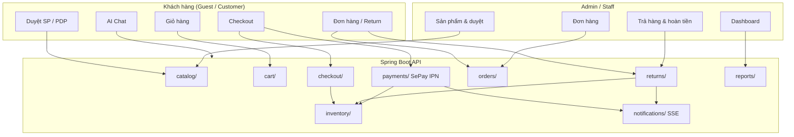

---

## 2. Xác thực & phiên

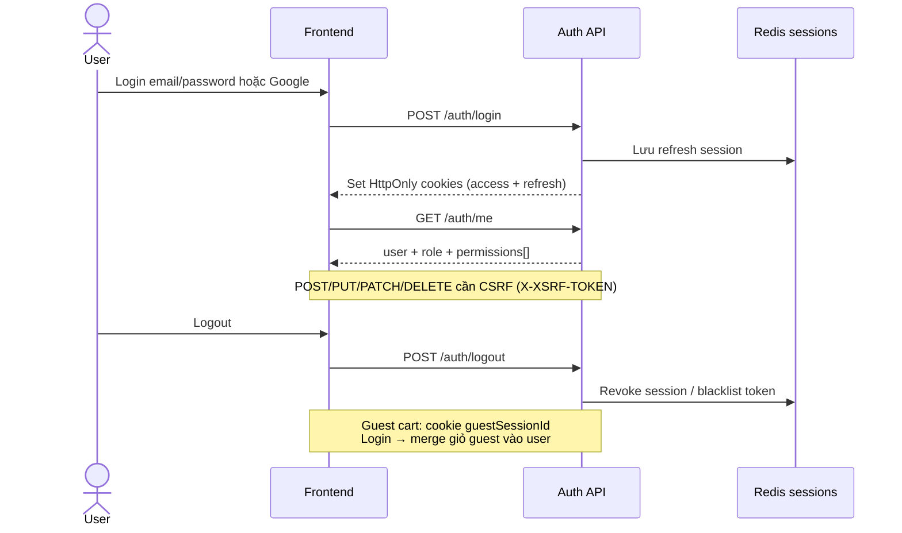

| Bước | Chi tiết |
|------|----------|
| Token | Access + refresh qua HttpOnly cookie |
| RBAC | `permissions[]` từ `/auth/me`; BE `@PreAuthorize` + `@perm.has` |
| Guest | Không token; giỏ qua `guestSessionId` |
| Checkout | **Bắt buộc đăng nhập** |

---

## 3. Duyệt sản phẩm & giỏ hàng

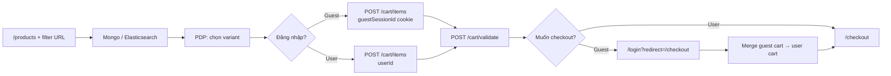

| Quy tắc | Giá trị |
|---------|---------|
| Variant | Phải ACTIVE, `available > 0` |
| Validate | FE debounce sau đổi số lượng |
| Merge | `GuestCartMergeService` khi login |

---

## 4. Checkout & thanh toán SePay

### 4.1. Checkout

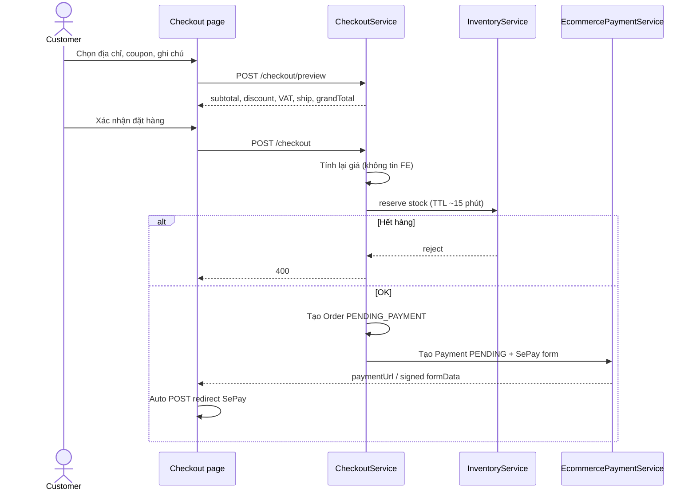

### 4.2. IPN thành công / thất bại

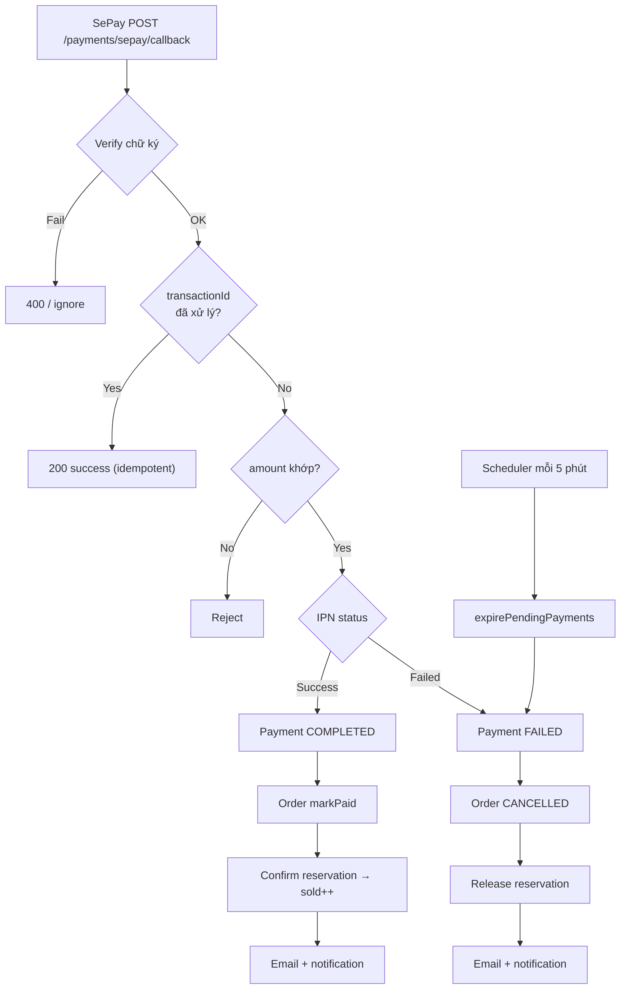

| Thành phần | Quy tắc |
|------------|---------|
| Phí ship | 30.000đ; miễn phí nếu subtotal ≥ 2.000.000đ |
| VAT | `VatCalculator`, mặc định rate = 0 |
| Coupon | PERCENTAGE / FIXED / FREE_SHIPPING |
| FE success | Poll BE ~12s; không tin redirect URL |

---

## 5. Vận hành đơn hàng

### 5.1. Vòng đời trạng thái

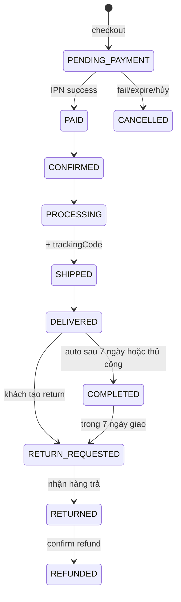

### 5.2. Luồng admin/staff

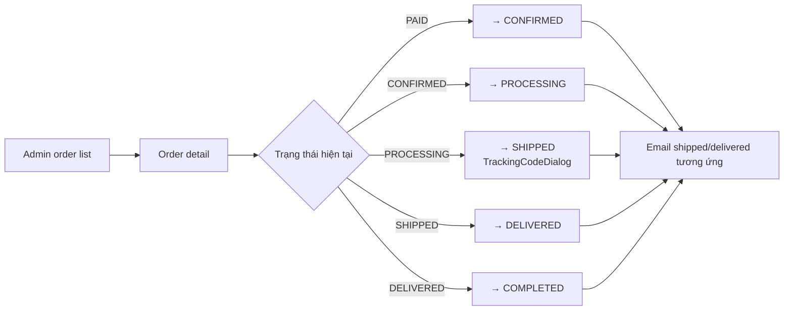

| Actor | Route |
|-------|-------|
| Staff/Admin | `/admin/orders`, `/staff/orders` |
| Chi tiết | `/admin/orders/:orderId` — items, payment, panel return |

---

## 6. Đổi / trả / hoàn tiền

> Spec đầy đủ: [`RETURN_REFUND_SPEC.md`](./RETURN_REFUND_SPEC.md)

### 6.1. State machine return

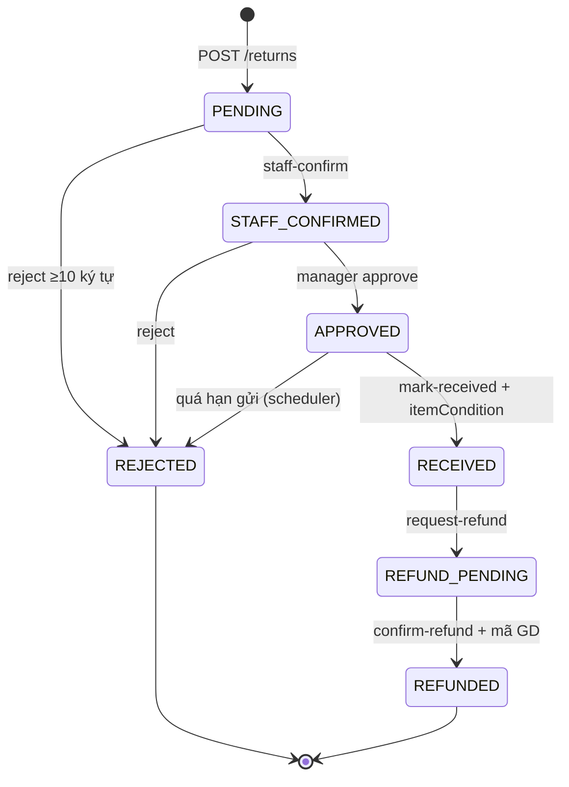

### 6.2. Luồng end-to-end (2 bên)

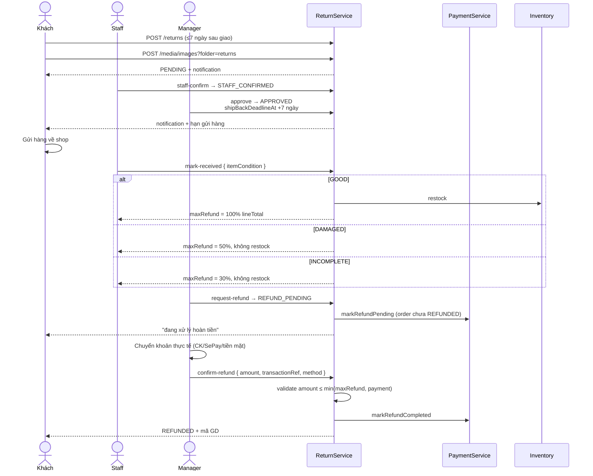

### 6.3. API bị chặn (bảo vệ shop)

`PUT /admin/returns/{id}/status` **không** cho phép:

| Status đích | Lý do |
|-------------|-------|
| `RECEIVED` | Phải dùng `POST .../mark-received` (bắt buộc `itemCondition`) |
| `REFUND_PENDING` | Phải dùng `POST .../request-refund` |
| `REFUNDED` | Phải dùng `POST .../confirm-refund` |

### 6.4. UI theo vai trò

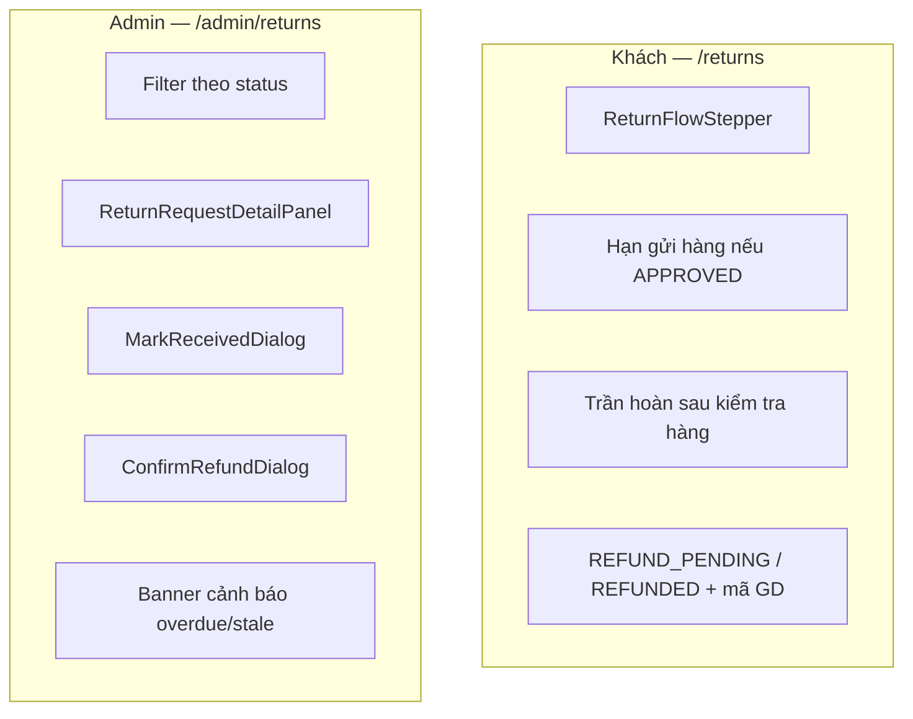

---

## 7. Duyệt sản phẩm (catalog)

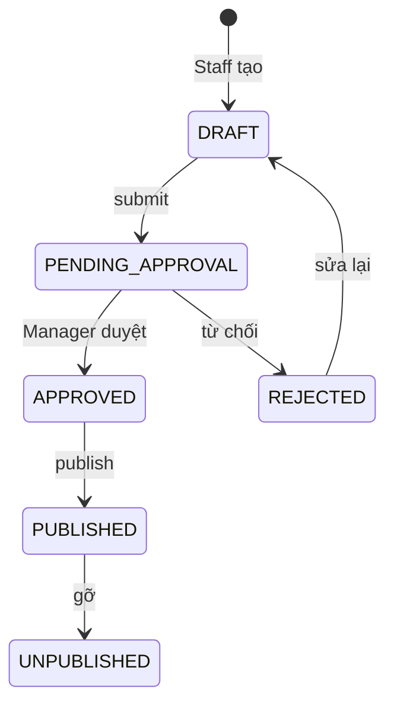

| Actor | Hành động |
|-------|-----------|
| STAFF | Tạo/sửa DRAFT |
| SHOP_MANAGER+ | Approve / reject / publish |
| ADMIN | Toàn quyền catalog |

Ảnh catalog admin: `POST /admin/catalog/images` (role admin).  
Ảnh review/return khách: `POST /media/images?folder=reviews|returns` (authenticated customer).

---

## 8. Tồn kho & scheduler

### 8.1. Vòng đời tồn kho

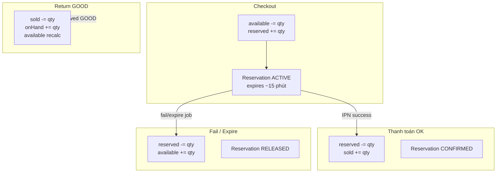

### 8.2. Scheduler (`EcommerceScheduler`)

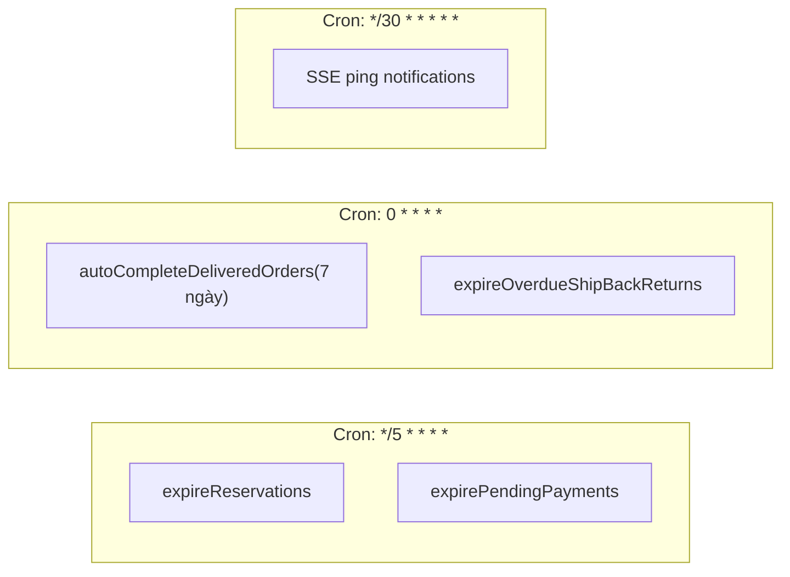

---

## 9. Thông báo real-time

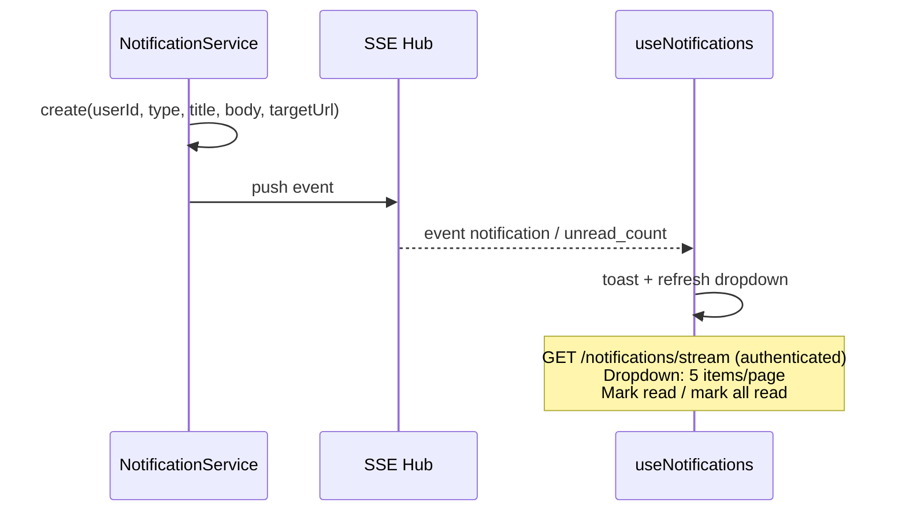

| Sự kiện return | NotificationType |
|----------------|------------------|
| Tạo yêu cầu | RETURN_REQUESTED |
| Duyệt trả | RETURN_APPROVED |
| Từ chối | RETURN_REJECTED |
| Chấp nhận hoàn | REFUND_PENDING |
| Đã chuyển tiền | REFUND_COMPLETED |

---

## 10. Đánh giá sản phẩm

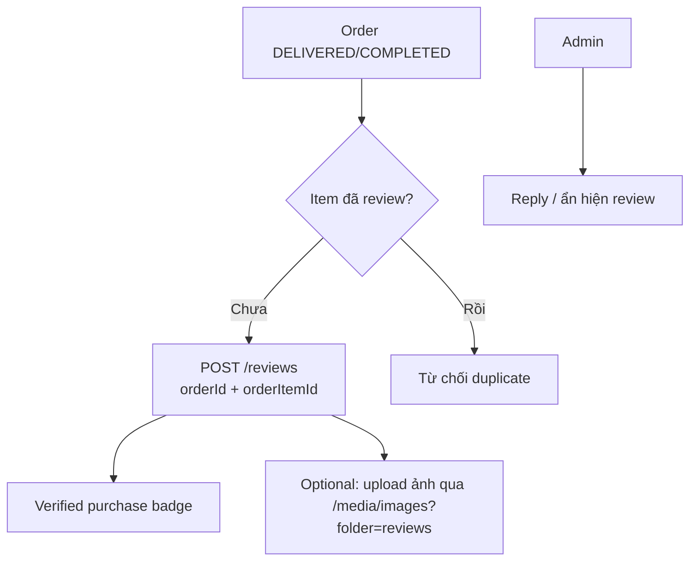

---

## 11. Upload ảnh khách hàng

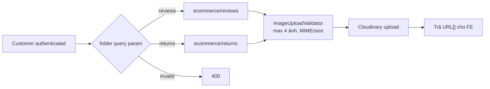

| Endpoint | Ai dùng |
|----------|---------|
| `POST /media/images?folder=returns` | Customer (return minh chứng) |
| `POST /media/images?folder=reviews` | Customer (review) |
| `POST /admin/catalog/images` | Staff/Admin (catalog) |

---

## 12. Báo cáo admin

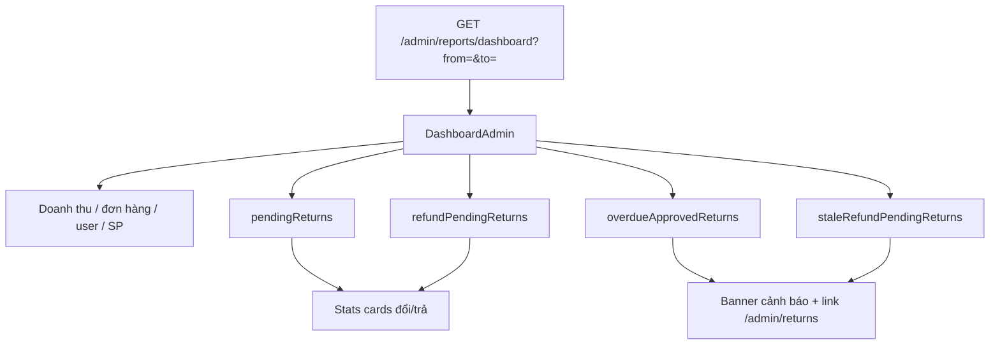

| Metric | Ý nghĩa vận hành |
|--------|------------------|
| `pendingReturns` | PENDING — cần staff xử lý |
| `refundPendingReturns` | Đã đồng ý hoàn, chờ chuyển tiền |
| `overdueApprovedReturns` | Khách chưa gửi hàng quá deadline |
| `staleRefundPendingReturns` | REFUND_PENDING > 3 ngày chưa confirm |

---

## 13. Trợ lý AI

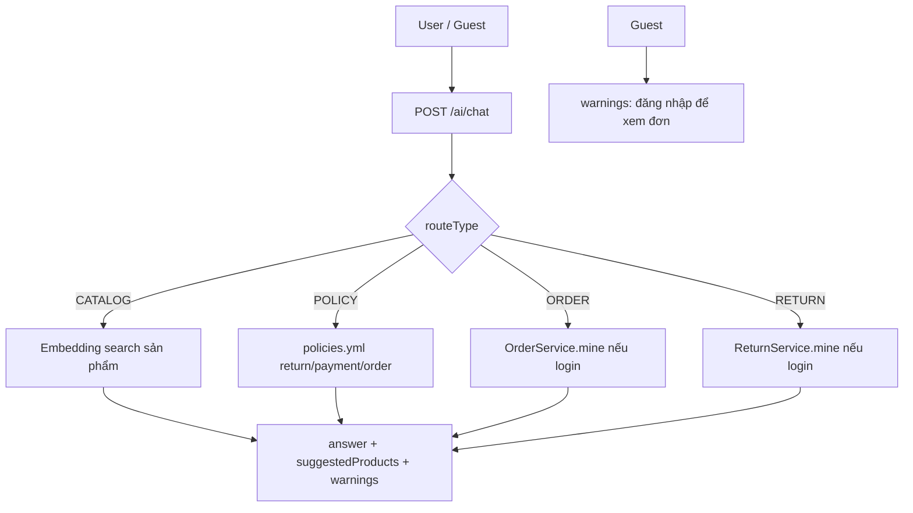

---

## Phụ lục — Kiểm thử tự động (08/2026)

| Suite | Phạm vi |
|-------|---------|
| BE `./gradlew test` | ~90 tests (ReturnServiceTest, ReturnRefundPolicyTest, payment, checkout, …) |
| FE `npm run test` | 28 tests (returnFlow, commerce, cart, …) |
| FE `npm run build` | TypeScript + Vite production build |
| E2E Playwright | Smoke: home, products, cart (chưa cover return/checkout dài) |

---

## Tài liệu liên quan

| File | Nội dung |
|------|----------|
| [`SHOE_ECOMMERCE_SPECIFICATION.md`](./SHOE_ECOMMERCE_SPECIFICATION.md) | Spec tổng hợp API, model, RBAC |
| [`RETURN_REFUND_SPEC.md`](./RETURN_REFUND_SPEC.md) | Return/refund chi tiết + audit |
| [`RUNBOOK_REFUND.md`](./RUNBOOK_REFUND.md) | Hướng dẫn vận hành hoàn tiền |
| [`STAGING_CHECKLIST.md`](./STAGING_CHECKLIST.md) | Checklist deploy staging |
| [`UI_DESIGN_SYSTEM.md`](./UI_DESIGN_SYSTEM.md) | Design tokens / components |
