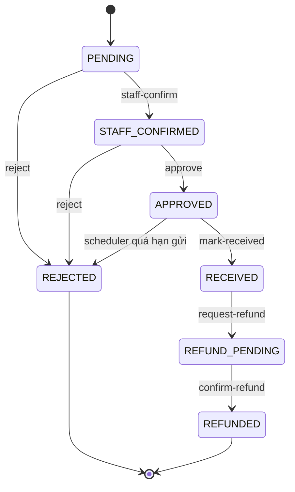

# Spec — Quy trình đổi/trả hàng & hoàn tiền (bảo vệ khách + shop)

Tài liệu mô tả **cơ chế end-to-end** cho return/refund trong Sole E-commerce: state machine, chính sách bảo vệ hai bên, API, dữ liệu audit, scheduler và UI admin.

> Sơ đồ trực quan: [`FUNCTIONAL_FLOWS.md` §6](./FUNCTIONAL_FLOWS.md#6-đổi--trả--hoàn-tiền)  
> Runbook vận hành ngắn: [`RUNBOOK_REFUND.md`](./RUNBOOK_REFUND.md)

---

## 1. Mục tiêu thiết kế

| Bên | Được bảo vệ bởi |
|-----|------------------|
| **Khách hàng** | Thông báo rõ từng bước; hoàn tiền chỉ khi shop xác nhận đã chuyển; audit mã GD; lý do từ chối ≥ 10 ký tự |
| **Shop** | Cửa sổ trả 7 ngày; hạn gửi hàng 7 ngày sau duyệt; kiểm tra tình trạng hàng → trần hoàn; validate số tiền; restock có điều kiện; cảnh báo REFUND_PENDING quá hạn |

---

## 2. State machine



Text tóm tắt:

```
PENDING → STAFF_CONFIRMED → APPROVED → RECEIVED → REFUND_PENDING → REFUNDED
              ↘ REJECTED
```

### 2.1. Trạng thái terminal

- `REJECTED` — từ chối (PENDING hoặc STAFF_CONFIRMED)
- `REFUNDED` — đã hoàn tiền và đóng case
- `CLOSED` — dự phòng (legacy)

### 2.2. Chuyển trạng thái hợp lệ

| Từ | Sang | Actor | API |
|----|------|-------|-----|
| PENDING | STAFF_CONFIRMED | Staff | `POST .../staff-confirm` |
| PENDING | REJECTED | Staff | `POST .../reject` |
| STAFF_CONFIRMED | APPROVED | Manager | `POST .../approve` |
| STAFF_CONFIRMED | REJECTED | Manager | `POST .../reject` |
| APPROVED | RECEIVED | Staff | `POST .../mark-received` |
| RECEIVED | REFUND_PENDING | Manager | `POST .../request-refund` |
| REFUND_PENDING | REFUNDED | Manager | `POST .../confirm-refund` |

**Không** dùng `PUT .../status` cho:

| Status đích | Thay thế bằng |
|-------------|---------------|
| `RECEIVED` | `POST .../mark-received` |
| `REFUND_PENDING` | `POST .../request-refund` |
| `REFUNDED` | `POST .../confirm-refund` |

Implementation: `ReturnStatusTransition.java`, guard trong `ReturnService.updateStatus()`.

---

## 3. Chính sách thời gian (`ReturnRefundPolicy`)

| Hằng số | Giá trị | Ý nghĩa |
|---------|---------|---------|
| `RETURN_WINDOW_DAYS` | 7 | Khách chỉ tạo return trong 7 ngày sau `order.deliveredAt` |
| `SHIP_BACK_DEADLINE_DAYS` | 7 | Sau `APPROVED`, khách phải gửi hàng về trong 7 ngày |
| `STALE_REFUND_PENDING_DAYS` | 3 | Cảnh báo dashboard nếu REFUND_PENDING > 3 ngày chưa confirm |
| `DAMAGED_REFUND_RATIO` | 0.5 | Trần hoàn khi hàng hỏng |
| `INCOMPLETE_REFUND_RATIO` | 0.3 | Trần hoàn khi thiếu phụ kiện |

---

## 4. Bảo vệ shop — chi tiết

### 4.1. Cửa sổ trả hàng (customer create)

- Order phải `DELIVERED`, `COMPLETED`, hoặc `RETURN_REQUESTED` (multi-item).
- `deliveredAt` phải trong vòng **7 ngày**.
- Mỗi `orderItemId` chỉ một return.
- File: `ReturnService.create()`, `validateReturnWindow()`.

### 4.2. Hạn gửi hàng sau duyệt

- Khi chuyển `APPROVED`: set `shipBackDeadlineAt = approvedAt + 7 ngày`.
- Thông báo khách gồm số ngày gửi hàng.
- **Staff không nhận hàng** nếu quá deadline (`markReceived` → 400).
- **Scheduler** (mỗi giờ): auto-reject các return `APPROVED` quá `shipBackDeadlineAt` với lý do cố định.
- File: `EcommerceScheduler.expireOverdueShipBackReturns()`.

### 4.3. Kiểm tra tình trạng hàng khi nhận (`RECEIVED`)

Bắt buộc body `MarkReceivedRequest`:

```json
{
  "itemCondition": "GOOD | DAMAGED | INCOMPLETE",
  "receiveNote": "...",   // bắt buộc ≥ 10 ký tự nếu DAMAGED/INCOMPLETE
  "note": "..."           // ghi chú staff (tuỳ chọn)
}
```

| `itemCondition` | Restock | Trần hoàn (`maxRefundAmount`) |
|-----------------|---------|-------------------------------|
| GOOD | Có (`InventoryService.restock`) | 100% `lineTotal` |
| DAMAGED | Không | `floor(lineTotal × 0.5)` |
| INCOMPLETE | Không | `floor(lineTotal × 0.3)` |

- Set `refundAmount = maxRefundAmount` (dự kiến).
- Order → `RETURNED`.

### 4.4. Validate số tiền hoàn (`confirm-refund`)

```
cap = min(maxRefundAmount, payment.amount)
confirm amount ≤ cap (+ epsilon 0.01)
```

- Bắt buộc: `amount > 0`, `transactionRef` ≥ 3 ký tự, `method` (enum).
- File: `ReturnService.validateRefundAmount()`.

### 4.5. Hoàn tiền hai bước (không REFUNDED sớm)

1. **request-refund** → `REFUND_PENDING`, `refundStatus = PENDING`
   - Order/payment **chưa** `REFUNDED`
   - Payment marked refund pending
2. Manager chuyển tiền thực tế (CK/SePay dashboard/tiền mặt)
3. **confirm-refund** → `REFUNDED`, `refundStatus = COMPLETED`
   - Order + payment → `REFUNDED`
   - Lưu audit đầy đủ

### 4.6. Từ chối & khôi phục đơn

- Reject yêu cầu lý do ≥ 10 ký tự.
- Nếu không còn return mở → order khôi phục `DELIVERED`/`COMPLETED`.
- Email + notification cho khách.

### 4.7. Báo cáo & cảnh báo admin

`GET /admin/reports/dashboard` bổ sung:

| Field | Ý nghĩa |
|-------|---------|
| `refundPendingReturns` | Số return đang REFUND_PENDING |
| `overdueApprovedReturns` | APPROVED quá `shipBackDeadlineAt` |
| `staleRefundPendingReturns` | REFUND_PENDING > 3 ngày từ `refundRequestedAt` |

FE `/admin/returns` **và** `/admin` dashboard hiển thị banner/stats khi có số liệu > 0.

---

## 5. Bảo vệ khách hàng

- Stepper 6 bước + hint theo vai trò (customer/staff).
- Notification tại: tạo yêu cầu, duyệt (kèm hạn gửi), từ chối, REFUND_PENDING, REFUND_COMPLETED (kèm mã GD).
- Upload ảnh qua `/api/media/images?folder=returns` (authenticated, không dùng admin catalog API).
- My Returns: trạng thái, **hạn gửi hàng** (APPROVED), **tình trạng hàng + trần hoàn**, lý do từ chối, REFUND_PENDING/REFUNDED + mã GD.

---

## 6. Model dữ liệu (`ReturnRequest`)

### 6.1. Trạng thái & workflow

```
returnId, orderId, orderItemId, userId
status: PENDING | STAFF_CONFIRMED | APPROVED | REJECTED | RECEIVED | REFUND_PENDING | REFUNDED | CLOSED
reason, customerNote, imageUrls[]
staffNote, managerNote, rejectedReason
```

### 6.2. Mốc thời gian

```
createdAt, updatedAt
staffConfirmedAt, approvedAt, receivedAt
refundRequestedAt, refundCompletedAt, refundedAt, rejectedAt, closedAt
shipBackDeadlineAt
```

### 6.3. Kiểm tra hàng & trần hoàn

```
itemCondition: GOOD | DAMAGED | INCOMPLETE
receiveNote
maxRefundAmount
refundAmount          // dự kiến / thực tế sau confirm
```

### 6.4. Audit hoàn tiền

```
refundStatus: NOT_REQUIRED | PENDING | PROCESSING | COMPLETED | FAILED
refundMethod: BANK_TRANSFER | SEPAY | CASH | OTHER
refundTransactionRef
refundProofUrl
refundNote
refundRequestedBy, refundedBy
```

### 6.5. Payment (`EcommercePayment`)

Khi request-refund: refund pending flags.  
Khi confirm-refund: lưu amount, method, transaction ref, proof, completed timestamp.

---

## 7. API reference

### 7.1. Customer

| Method | Path | Mô tả |
|--------|------|-------|
| POST | `/returns` | Tạo yêu cầu |
| GET | `/returns`, `/returns/my-returns` | Danh sách của tôi |
| GET | `/returns/{id}` | Chi tiết (owned) |
| POST | `/media/images?folder=returns` | Upload ảnh minh chứng |

### 7.2. Admin / Staff

| Method | Path | Role | Mô tả |
|--------|------|------|-------|
| GET | `/admin/returns` | Staff+ | List + filter status |
| POST | `/admin/returns/{id}/staff-confirm` | Staff+ | PENDING → STAFF_CONFIRMED |
| POST | `/admin/returns/{id}/reject` | Staff/Manager | Reject + lý do |
| POST | `/admin/returns/{id}/approve` | Manager+ | APPROVED + deadline |
| POST | `/admin/returns/{id}/mark-received` | Staff+ | RECEIVED + condition |
| POST | `/admin/returns/{id}/request-refund` | Manager+ | REFUND_PENDING |
| POST | `/admin/returns/{id}/confirm-refund` | Manager+ | REFUNDED + audit |
| POST | `/admin/returns/{id}/refund` | Manager+ | **Deprecated** → request-refund |

### 7.3. Confirm refund body

```json
{
  "amount": 450000,
  "transactionRef": "FT260830123456",
  "method": "BANK_TRANSFER",
  "proofUrl": "https://...",
  "note": "Hoàn CK Vietcombank"
}
```

---

## 8. Đồng bộ Order

| Return status | Order status | Order item.returnStatus |
|---------------|--------------|-------------------------|
| PENDING … APPROVED | RETURN_REQUESTED | sync |
| RECEIVED | RETURNED | sync |
| REFUND_PENDING | (giữ RETURNED / RETURN_REQUESTED flow) | sync |
| REFUNDED | REFUNDED + payment REFUNDED | sync |
| REJECTED (no open returns) | Khôi phục DELIVERED/COMPLETED | cleared |

---

## 9. SePay / chuyển khoản

- Thanh toán gốc qua SePay QR/CK **không có API refund tổng quát** sau quyết toán.
- Shop hoàn **thủ công** (Internet Banking, SePay Merchant, tiền mặt).
- Bắt buộc ghi `refundTransactionRef` khi confirm — phục vụ đối soát kế toán.
- `REFUND_PENDING` = đã đồng ý hoàn trên hệ thống, **chưa** xác nhận tiền đã chuyển.

---

## 10. Frontend

| Màn hình | Thành phần |
|----------|-----------|
| Customer `/returns` | Stepper, hạn gửi, trần hoàn, REFUND banners |
| Admin `/admin/returns` | Stepper, dialogs, detail panel, alert banner |
| Admin `/admin` dashboard | 4 stats return + banner cảnh báo + link |
| Order detail | Link return, nút tạo return |

### 10.1. Luồng nút admin theo status

```
PENDING        → [Xác nhận] [Từ chối]
STAFF_CONFIRMED → [Duyệt] [Từ chối]
APPROVED       → [Đã nhận hàng]  → MarkReceivedDialog
RECEIVED       → [Yêu cầu hoàn tiền]
REFUND_PENDING → [Xác nhận đã hoàn] → ConfirmRefundDialog (max amount)
```

---

## 11. Scheduler

`EcommerceScheduler` (hourly):

1. `expireOverdueShipBackReturns()` — auto-reject APPROVED quá hạn gửi hàng.

(Future: job nhắc email REFUND_PENDING stale — hiện chỉ dashboard alert.)

---

## 12. Test & file tham chiếu

| File | Vai trò |
|------|---------|
| `ReturnRefundPolicy.java` | Hằng số + compute max refund + restock rule |
| `ReturnRefundPolicyTest.java` | Unit test tỷ lệ hoàn |
| `ReturnServiceTest.java` | State machine, mark-received, refund validate |
| `ReturnStatusTransition.java` | State machine |
| `ReturnService.java` | Business logic |
| `ReturnController.java` | REST |
| `ReportService.java` | Dashboard counters |
| `fe/src/utils/returnFlow.ts` | Stepper + action map |
| `fe/src/utils/returnFlow.test.ts` | Vitest luồng nút admin |
| `fe/src/components/returns/*` | Dialogs & detail panel |

---

## 13. Checklist audit một case REFUNDED

- [ ] `itemCondition` + `receiveNote` (nếu không GOOD)
- [ ] `maxRefundAmount` khớp condition
- [ ] `refundAmount` ≤ cap khi confirm
- [ ] `refundTransactionRef` + `refundMethod`
- [ ] `refundedBy` + `refundCompletedAt`
- [ ] Order/payment status REFUNDED
- [ ] Notification REFUND_COMPLETED gửi khách

---

## 14. Known limitations / roadmap

- Partial refund theo % tuỳ chỉnh (ngoài 3 mức condition) — chưa có UI.
- Auto email khi stale REFUND_PENDING — chỉ dashboard.
- SePay auto-refund API — không khả dụng; giữ manual confirm.
- Multi-payment gateway — chưa hỗ trợ split refund.
